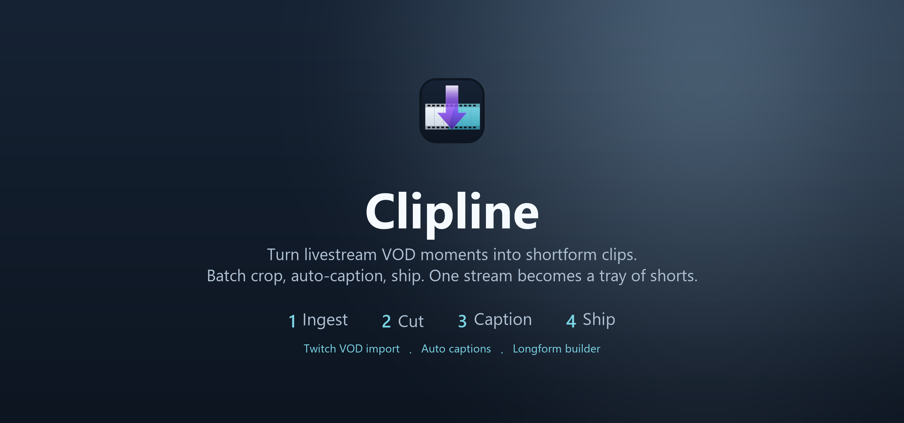

<p align="center">
  
</p>

**Turn livestream VOD moments into shortform clips — batch crop, faster-whisper auto-captions, ASS/SRT export. A six-hour stream becomes a tray of ready-to-post shorts.**

<p align="center">
  
  
  
  
  
</p>

---

## What it does

- Create multi-clip VOD projects for stream sessions.
- Pull recent Twitch VODs, Twitch markers, and Twitch clips via shared `auth.deutschmark.online` Twitch login.
- Import manual timestamps from any hotkey or marker workflow.
- Surface all those moments in a `Session Inbox`.
- Prep moments as shorts with streamer-specific presets:
  - `Gameplay Focus`
  - `Facecam Top`
  - `Baked Text Punch`
- Batch-prep a whole inbox and batch-queue prepared shorts for longform.
- Stitch clips into a preview sequence, transcribe captions, and export.
- Build a horizontal longform derivative from queued prepared shorts.
- Use a saved facecam guide instead of auto-detection for recurring stream layouts.

### Captions

- 1-click caption dependency install for `faster-whisper` + `torch`.
- Managed captioning virtualenv owned by the app.
- Optional `pyannote.audio` install for diarization.
- Editable captions with speaker colors, ASS/SRT export, and burn-in control.

---

## Getting started

### Run from source

```bash
git clone https://github.com/thedeutschmark/clipline.git
cd clipline
pip install -r requirements.txt
python desktop.py
```

Browser-only mode:

```bash
python app.py
```

The local app runs on `http://localhost:3000` by default.

### Build the EXE

```bat
build.bat
```

Outputs `dist\clipline.exe`.

---

## Configuration

### State location

Clipline stores its settings, runtime tools, and captioning virtualenv in:

- Windows: `%LOCALAPPDATA%\clipline\`

### Environment overrides

| Variable | Default | Description |
| --- | --- | --- |
| `CLIPLINE_HOST` | `localhost` | Bind host |
| `CLIPLINE_PORT` | `3000` | Bind port |
| `CLIPLINE_SHARED_AUTH_URL` | `https://auth.deutschmark.online` | Shared Twitch auth origin |

---

## deutschmark's other apps

<table>
<tr><td></td><td><b><a href="https://github.com/thedeutschmark/alert-alert">Alert! Alert!</a></b><br>Stream-alert clips from any video source.</td></tr>
<tr><td></td><td><b><a href="https://toolset.deutschmark.online">The Stream Toolset</a></b><br>OBS overlays + companion apps. One login, no subscriptions.</td></tr>
<tr><td></td><td><b><a href="https://github.com/thedeutschmark/forgetmenot">ForgetMeNot</a></b><br>A Twitch chat bot that remembers your regulars.</td></tr>
<tr><td></td><td><b><a href="https://collab.deutschmark.online">Collab Planner</a></b><br>Finds collab windows from streamers' broadcast history.</td></tr>
<tr><td></td><td><b><a href="https://yourpathos.app">P.A.T.H.O.S.</a></b><br>AI career platform — resume tailoring + ATS scoring.</td></tr>
</table>

<sub>All projects → <a href="https://github.com/thedeutschmark">github.com/thedeutschmark</a></sub>

## License

AGPL-3.0 — see [LICENSE](LICENSE).
