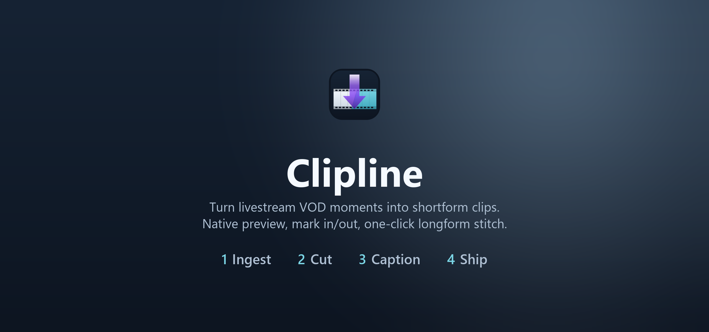

<p align="center">
  
</p>

**Turn livestream VOD moments into shortform clips — facecam-stacked verticals in 1080p or 4K, auto-captions, ASS/SRT export. A six-hour stream becomes a tray of ready-to-post shorts.**

<p align="center">
  
  
  
  
  
</p>

---

## What it does

- Create multi-clip VOD projects for stream sessions.
- Pull recent Twitch VODs, Twitch markers, and Twitch clips via shared `auth.deutschmark.online` Twitch login.
- Import manual timestamps from any hotkey or marker workflow.
- Surface all those moments in a `Session Inbox`.
- Prep moments as shorts with streamer-specific presets:
  - `Gameplay Focus`
  - `Facecam Top` — real stacked composition: your facecam (guide-drawn, rounded corners) over the game on a blurred backdrop, captions burned into the dark zone. 1080x1920 and 4K 2160x3840.
  - `Baked Text Punch`
- **Create Clip from Moment** — mark a range, click once: the clip is cut, the vertical facecam layout switches on, and you're walked to captions.
- Batch-prep a whole inbox and batch-queue prepared shorts for longform.
- Stitch clips into a preview sequence, transcribe captions, and export.
- Build a horizontal longform derivative from queued prepared shorts.
- Draw a facecam guide once over a grabbed frame — remembered every session for recurring stream layouts, with a live preview of the vertical composition.

### Captions

- 1-click caption engine download (whisper.cpp, ~75 MB) — no Python, no pip, no terminal.
- Optional speaker separation (sherpa-onnx, ~50 MB), same one-click model.
- Editable captions with speaker colors, ASS/SRT export, and burn-in control.

---

## Getting started

### Run from source

```bash
git clone https://github.com/thedeutschmark/clipline.git
cd clipline
pip install -r requirements.txt
python desktop.py
```

Browser-only mode:

```bash
python app.py
```

The local app runs on `http://localhost:3000` by default.

### Build the EXE

```bat
build.bat
```

Outputs `dist\clipline.exe`.

---

## Configuration

### State location

Clipline stores its settings, runtime tools, and captioning virtualenv in:

- Windows: `%LOCALAPPDATA%\clipline\`

### Environment overrides

| Variable | Default | Description |
| --- | --- | --- |
| `CLIPLINE_HOST` | `localhost` | Bind host |
| `CLIPLINE_PORT` | `3000` | Bind port |
| `CLIPLINE_SHARED_AUTH_URL` | `https://auth.deutschmark.online` | Shared Twitch auth origin |

---

## deutschmark's other apps

<table>
<tr><td align="center" width="56"></td><td><a href="https://yourpathos.app"><b>Pathos</b></a><br>Worker-side job search with source-linked roles, evidence-checked resumes, and application tracking.</td></tr>
<tr><td align="center" width="56"></td><td><a href="https://github.com/thedevmark/markskill"><b>Markskill</b></a><br>A product-engineering skill for AI agents: trace behavior to its owner, fix root causes, shape interfaces around real tasks, and verify claims with evidence.</td></tr>
<tr><td align="center" width="56"></td><td><a href="https://github.com/thedevmark/alert-alert"><b>Alert! Alert!</b></a><br>Turn a video URL or local file into a cropped, trimmed stream alert.</td></tr>
<tr><td align="center" width="56"></td><td><a href="https://github.com/thedevmark/auto-iphone-uploader"><b>Auto iPhone Uploader</b></a><br>Write a video's title and captions once on your PC, then post it from the real apps on your iPhone. Early preview.</td></tr>
<tr><td align="center" width="56"></td><td><a href="https://streamer.deutschmark.online"><b>Streamer Online</b></a><br>Build OBS scenes and browser-source overlays with connected streamer tools.</td></tr>
<tr><td align="center" width="56"></td><td><a href="https://github.com/thedevmark/forgetmenot"><b>ForgetMeNot</b></a><br>A local-first Twitch bot that remembers regulars, callbacks, and stream lore.</td></tr>
</table>

<sub>All projects → <a href="https://github.com/thedevmark">github.com/thedevmark</a></sub>

## License

AGPL-3.0 — see [LICENSE](LICENSE).
